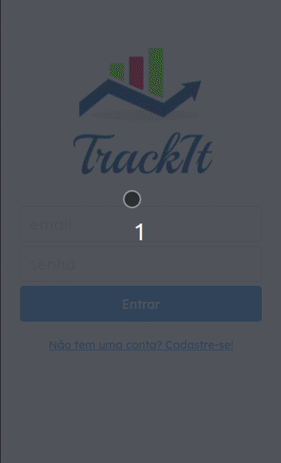

# TrackIt

A habits tracking app written in React that allows you to improve your discipline.

## A gif using the app

### Try by your self!

https://track-it-plum.vercel.app/

### About this project

This is one of the projects of my personal portfolio, so, any feedback about the project, code or anything that you can report that could make me a better developer will be welcome!

In this app you can create an acount (the image field needs to be filled with a URL), login with your email and password, create your habbit choosing the habit name's and the weekdays you will do this habit, you can navigate to the today page and see wicth habit you have alredy do today and you can navigate to the history page and see your history of days that you did all the habits of the day. 

I build this project to test my knowlodge about react, react router, react hooks, styled componentes, context api, but mainly for taste how we work with sign-up, login and the use of token in this type of aplication. Other reason was to test another librarys, until now i was just using the big ones like react.

I'll add one more feature in the future: when user click in a day of the calendar, it opens a component showing witch habits he had in that day.

### Tecnologies used

- React
- React-Router
- React Hooks
- Context API
- Styled Components
- Axios

### To run this project

Install the dependencies with `npm install`, run `npm run start` to run the app, it will be open in http://localhost:3000.
